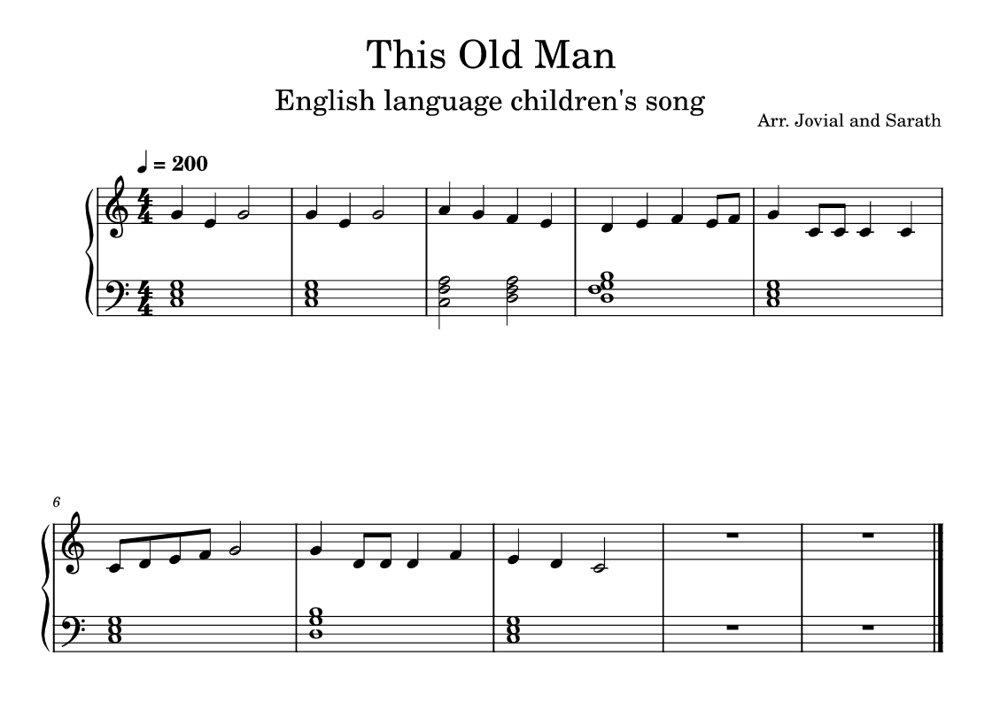

# Song List

List of Songs with derived chord

## 1. This old man

<table>
<tr>
    <td> Sl No. </td>
    <td> Song Name </td>
    <td> Chords </td>
    <td> Sheets </td>
</tr>

<tr>
    <td> 01 </td>
    <td><a href="Songs/../ThisOldMan">This Old Man</a></td>
    <td>
<pre>
C             Em
This old man, he plays one

F        Dm          G7
He plays knick knack on my thumb, With a

C
knick knack paddy wack,

G
Give a dog a bone,

Em
This old man comes

C
rolling home
</pre>
    </td>
    <td>
        
    </td>
</tr>

<tr>
    <td> 02 </td>
    <td><a href="Songs/../TwinkleTwinkleLittleStar">Twinkle Twinkle Little Star</a></td>
    <td>
<pre>

Twinkle twinkle little star,

How I wonder what you are,

Up above the world so high,

Like a dimond in the sky.
</pre>
    </td>
    <td>
        
    </td>
</tr>

</table>
